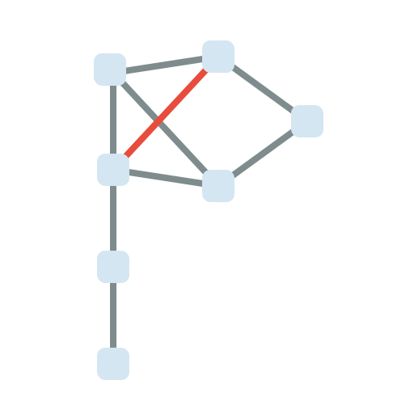
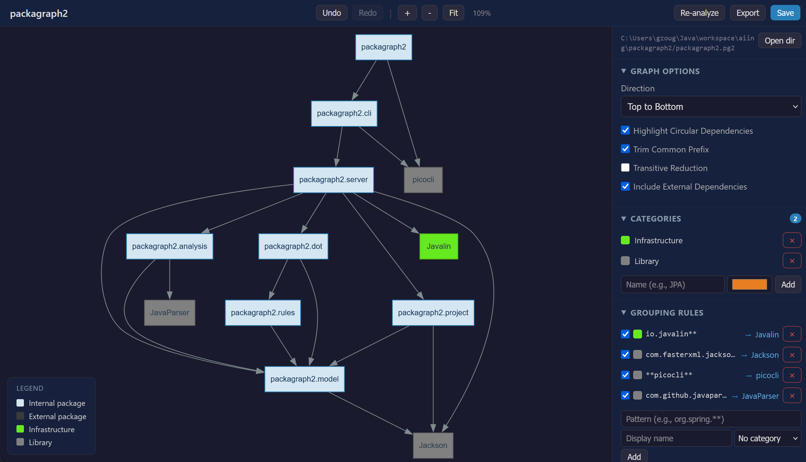

<p align="center">
  
</p>

[](https://github.com/gzougianos/packagraph2/actions/workflows/release.yml)

# packagraph2

An interactive Java package dependency browser and visualizer. Point it at any Java codebase and get a live, explorable graph of how your packages depend on each other — no compilation or build system required.


(Using packagraph2 into packagraph2's source code: *packagraph2.pg2* project)

## AI Development Disclaimer

This project is a **proof of concept** exploring what AI-assisted development can achieve. It is the spiritual successor to [packagraph](https://github.com/gzougianos/packagraph), which was manually developed with a full test suite covering all important parts.

**packagraph2** was built almost entirely with AI (Claude) in roughly **1.5 days** — from zero to a fully functional interactive web UI with features the original never had (live graph editing, undo/redo, categories, comments, export to multiple formats, git clone support, etc.).

The most striking difference is in testing: the original packagraph has automated tests for its core logic because a human developer needs that safety net to refactor and evolve the code with confidence. This version has **no tests** — when the AI writes the code, it can re-read, understand, and regenerate any part of the system on demand. 
Whether that trade-off holds up long-term is the question this project helps explore.

## Features

- **Zero setup analysis** — parses Java source files directly with JavaParser; no need to compile the project or configure a build tool
- **Interactive web UI** — pan, zoom, click, and right-click your way through the dependency graph rendered via Graphviz (viz.js/WASM)
- **Grouping rules** — collapse multiple packages into a single named node (e.g., `org.springframework.**` → "Spring")
- **Hiding rules** — hide irrelevant packages by pattern (e.g., `java.**`, `lombok.**`)
- **Categories** — color-code groups with user-defined categories and a color picker
- **Edge details** — click any edge to see exactly which classes cause that dependency
- **Class inspector** — right-click a package to see all its classes with kind (class/interface/enum/record/annotation) and scope
- **Package comments** — annotate any node with a comment, shown on hover
- **Circular dependency detection** — highlights cycles in red
- **Transitive reduction** — hide redundant edges implied by transitive dependencies
- **Common prefix trimming** — shorten `com.myapp.service.user` to `service.user` for readability
- **Multi-module support** — select which source directories to include
- **Clone from Git** — clone a remote repo (with optional branch) and analyze it directly
- **Undo/Redo** — full undo/redo for all rule and option changes
- **Export** — SVG, PNG, PNG @2x, DOT, and JSON
- **Project files** — save and load `.pg2` project files to preserve your rules and configuration

## Usage

```bash
# Open an existing project
java -jar packagraph2.jar serve --project myproject.pg2

# Start fresh — create a new project by pointing at a source directory
java -jar packagraph2.jar serve
```


